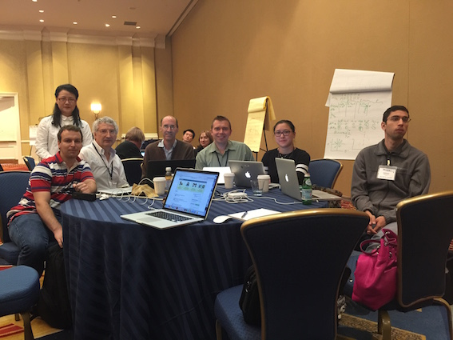

# jhu-immuno
Johns Hopkins DaSH Immuno group

## How to use this code

1. Download Anaconda IDE from http://continuum.io/downloads
2. In Linux, just give the permission to run Anaconda-[Version]-Linux-[i386|x86_64].sh using the command:
$ chmod u+x Anaconda-[Version]-Linux-[i386|x86_64].sh
3. Run spyder from shell - '$ spyder'

Now it is possible to run each Python file inside code/ folder.

## links

Peptides 9 props normalized - https://s3-us-west-1.amazonaws.com/jhu-dash/peptide_9_props_norm.csv

## Sources

- github.com/hammerlab/pepdata - Source of the dataset used in this project.
- pics/genetic_code.png - Image from a course from Coursera 'Bioinformatics Algorithms' by Pavel Pevzner and Phillip Compeau.

## Team

